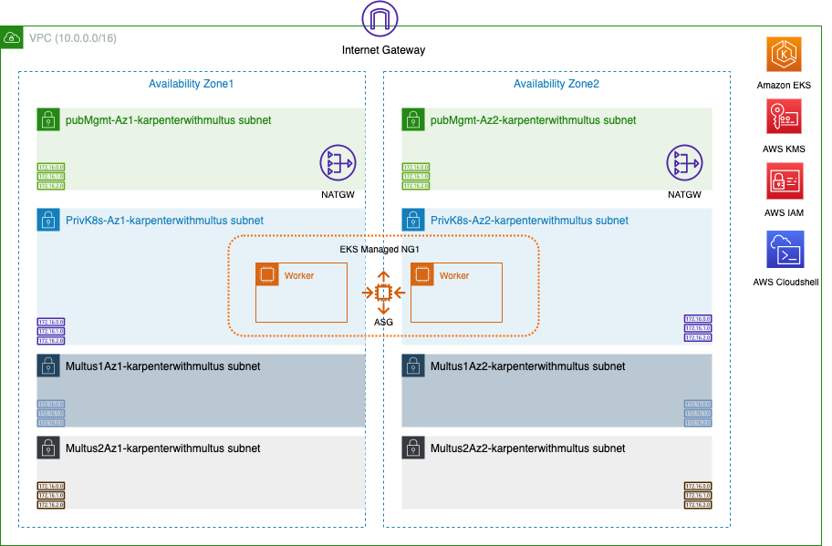
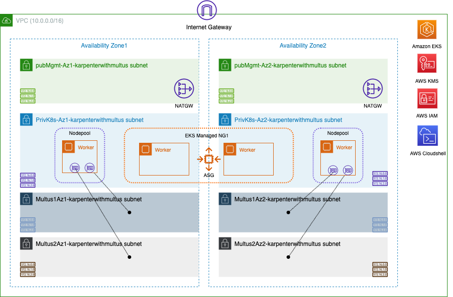

# Karpenter with Multus on EKS

## Related References

Related references

Please find further details on Multus & Karpenter in the following links -

[1] <https://aws.amazon.com/blogs/containers/amazon-eks-now-supports-multus-cni/>

[2] <https://docs.aws.amazon.com/eks/latest/userguide/pod-multiple-network-interfaces.html>

[3] <https://github.com/aws-samples/eks-install-guide-for-multus>

[4] <https://karpenter.sh/docs/getting-started/getting-started-with-karpenter/>

[5] <https://github.com/aws-samples/cfn-multus-eks-managed-ng#approach-2-using-userdata-without-lambda>

[6] <https://github.com/aws-samples/eks-automated-ipmgmt-multus-pods>

## Prerequisites

* An [AWS Cloudshell](https://aws.amazon.com/cloudshell/)

## Environment Setup

In this setup we will create VPC, EKS Clusters, EKS Managed Node Group, Security Groups, and associated VPC components.

1.	We will use AWS Cloudshell environment from here to configure the EKS cluster and deploy a sample application. Go to your Cloudshell console, download this git repository and start by executing the following script to Install the needed tools (awscli, kubectl, eksctl, helm etc) needed.


``` sh
sudo chmod +x tools/installTools.sh && ./tools/installTools.sh

```

2.	Create a Cloudformation stack using template vpc-infra-mng.yaml. Select 2 Availability zones (e.g. us-west-2a & us-west-2b). Name your stack as karpenterwithmultus (you will need this stack name later in your Cloudshell environment). You can keep all other parameters default. You can use the AWCLI command below or use the AWS Console using the Cloudformation menu.

```sh
aws cloudformation create-stack --stack-name karpenterwithmultus --template-body file://cfn-templates/vpc-infra-mng.yaml --parameters ParameterKey=AvailabilityZones,ParameterValue=us-west-2a\\,us-west-2b --region us-west-2  --capabilities CAPABILITY_NAMED_IAM

```

Before executing the next steps - ensure the first CFN stack creation is completed Please note that the stack creation may take ~ 15 minutes as it builds the EKS cluster & Worker nodes.


The resulting architecture will look like this below



3.	On your Cloudshell, create environment variables to define Karpenter version, EKS Cluster name, region. Please ensure you change the parameter values according to your environment. And then go to the Cloudshell console and execute the following commands. 


```sh
export KARPENTER_NAMESPACE=karpenter
export K8S_VERSION=1.29
export KARPENTER_VERSION=v0.32.3
export AWS_PARTITION="aws"
export VPC_STACK_NAME="karpenterwithmultus"
export CLUSTER_NAME="eks-${VPC_STACK_NAME}"
export AWS_DEFAULT_REGION=us-west-2 
export AWS_ACCOUNT_ID="$(aws sts get-caller-identity --query Account --output text)"
export TEMPOUT=$(mktemp)

```

***NOTE: VPC_STACK_NAME is the name you gave for your cloudformation template vpc-infra-mng.yaml.***

***NOTE: Pay special attention to the default region value and correct EKS version. In later steps your nodepool.yaml config is configured with availability zones.***

***NOTE: This example uses Cloudshell as your admin node. Environment variables are lost when Cloudshell times out. Feel free to use your own admin node.***

Update your kubeconfig and test EKS control plane access

```sh
aws eks update-kubeconfig --name $CLUSTER_NAME
kubectl get nodes
kubectl get pods -A

```

If you don't get an error, it means you have access to the K8S cluster

## Plugin Setup

4.	Install Multus CNI plugin. [Multus CNI](https://github.com/k8snetworkplumbingwg/multus-cni) is a container network interface plugin for Kubernetes that enables attaching multiple network interfaces to pods. If you want to understand Multus CNI and VPC CNI and how they work together on Amazon EKS, refer to this [blogpost](https://aws.amazon.com/blogs/containers/amazon-eks-now-supports-multus-cni/).

```sh
kubectl apply -f https://raw.githubusercontent.com/aws/amazon-vpc-cni-k8s/master/config/multus/v4.0.2-eksbuild.1/multus-daemonset-thick.yml
kubectl get daemonsets.apps -n kube-system

```

5.	We need to have CIDR reservations on the Multus subnets since we will dedicate a portion of the IPs for Multus pod IPs. CIDR reservation with explicit flag tells the VPC not to touch these CIDR blocks when creating VPC resources like ENI. Execute CIDR reservation commands below on the Multus subnets. We are going to reserve /27.

```sh
Multus1Az1subnetId=$(aws ec2 describe-subnets --filters "Name=tag:Name,Values=Multus1Az1-${VPC_STACK_NAME}" --query "Subnets[*].SubnetId" --output text)
aws ec2 create-subnet-cidr-reservation --subnet-id ${Multus1Az1subnetId} --cidr 10.0.4.32/27 --reservation-type explicit --region ${AWS_DEFAULT_REGION}
Multus1Az2subnetId=$(aws ec2 describe-subnets --filters "Name=tag:Name,Values=Multus1Az2-${VPC_STACK_NAME}" --query "Subnets[*].SubnetId" --output text)
aws ec2 create-subnet-cidr-reservation --subnet-id ${Multus1Az2subnetId} --cidr 10.0.5.32/27 --reservation-type explicit --region ${AWS_DEFAULT_REGION}
Multus2Az1subnetId=$(aws ec2 describe-subnets --filters "Name=tag:Name,Values=Multus2Az1-${VPC_STACK_NAME}" --query "Subnets[*].SubnetId" --output text)
aws ec2 create-subnet-cidr-reservation --subnet-id ${Multus2Az1subnetId} --cidr 10.0.6.32/27 --reservation-type explicit --region ${AWS_DEFAULT_REGION}
Multus2Az2subnetId=$(aws ec2 describe-subnets --filters "Name=tag:Name,Values=Multus2Az2-${VPC_STACK_NAME}" --query "Subnets[*].SubnetId" --output text)
aws ec2 create-subnet-cidr-reservation --subnet-id ${Multus2Az2subnetId} --cidr 10.0.7.32/27 --reservation-type explicit --region ${AWS_DEFAULT_REGION}

```
***NOTE: if you are getting an error - subnet ID doesnt exists - check if you have defined the correct AWS_DEFAULT_REGION env variable***

6.	Install Whereabouts plugin. Whereabouts is an IPAM CNI plugin which we will use to managed the Multus pod IP addresses that we set aside from the previous step. Multus pod Ips through whereabouts will be defined via Custom Resource Definition (CRD) Network-Attachment-Definitions (NAD).

```sh
kubectl apply -f https://raw.githubusercontent.com/k8snetworkplumbingwg/whereabouts/master/doc/crds/daemonset-install.yaml
kubectl apply -f https://raw.githubusercontent.com/k8snetworkplumbingwg/whereabouts/master/doc/crds/whereabouts.cni.cncf.io_ippools.yaml
kubectl apply -f https://raw.githubusercontent.com/k8snetworkplumbingwg/whereabouts/master/doc/crds/whereabouts.cni.cncf.io_overlappingrangeipreservations.yaml
kubectl get daemonsets.apps -n kube-system

```

7.	Apply NetworkAttachmentDefinitions on the cluster. This will configure the multus interfaces on the pods when we create the application pods later. If you will inspect the file you will notice that the range we defined are the CIDR reservation prefixes we set aside in the previous step.

```sh
kubectl apply -f  sample-application/multus-nad-az1.yaml
kubectl apply -f  sample-application/multus-nad-az2.yaml

```

## IAM Role Setup

8.	Create Karpenter IAM role and other pre-requisites needed for Karpenter. You should see "Successfully created/updated stack - <Karpenter-${CLUSTER_NAME}>" at the end of this step.

```sh
curl -fsSL https://raw.githubusercontent.com/aws/karpenter/"${KARPENTER_VERSION}"/website/content/en/preview/getting-started/getting-started-with-karpenter/cloudformation.yaml  > $TEMPOUT \
&& aws cloudformation deploy \
  --stack-name "Karpenter-${CLUSTER_NAME}" \
  --template-file "${TEMPOUT}" \
  --capabilities CAPABILITY_NAMED_IAM \
  --parameter-overrides "ClusterName=${CLUSTER_NAME}"

```

```sh
eksctl create iamidentitymapping \
  --username system:node:{{EC2PrivateDNSName}} \
  --cluster "${CLUSTER_NAME}" \
  --arn "arn:aws:iam::${AWS_ACCOUNT_ID}:role/KarpenterNodeRole-${CLUSTER_NAME}" \
  --group system:bootstrappers \
  --group system:nodes
  
eksctl utils associate-iam-oidc-provider \
    --cluster "${CLUSTER_NAME}" \
    --approve

eksctl create iamserviceaccount \
  --cluster "${CLUSTER_NAME}" --name karpenter --namespace karpenter \
  --role-name "${CLUSTER_NAME}-karpenter" \
  --attach-policy-arn "arn:aws:iam::${AWS_ACCOUNT_ID}:policy/KarpenterControllerPolicy-${CLUSTER_NAME}" \
  --role-only \
  --approve

```

```sh
export KARPENTER_IAM_ROLE_ARN="arn:${AWS_PARTITION}:iam::${AWS_ACCOUNT_ID}:role/${CLUSTER_NAME}-karpenter"

echo $KARPENTER_IAM_ROLE_ARN

```

9.	Create a IAM policy for additional actions required for Multus and attach it to Karpenter Node Role. The userdata section of EC2NodeClass contains a script that creates, attaches, and configures ENIs to Karpenter provisioned nodes. The nodes need the right policies to be attached to the Karpenter node role.

```sh
aws iam create-policy --policy-name karpenter-multus-policy --policy-document file://config/multus-policy.json | jq -r '.Policy.Arn'
karpentermultuspolicyarn=$(aws iam list-policies | jq -r '.Policies[] | select(.PolicyName=="karpenter-multus-policy") | .Arn')
aws iam attach-role-policy --policy-arn $karpentermultuspolicyarn --role-name KarpenterNodeRole-${CLUSTER_NAME}

```


10.	(Optional) Run the following command to create a role to allow use of spot instances. If the role has already been successfully created, you will see: `# An error occurred (InvalidInput) when calling the CreateServiceLinkedRole operation: Service role name AWSServiceRoleForEC2Spot has been taken in this account, please try a different suffix.`

```sh
aws iam create-service-linked-role --aws-service-name spot.amazonaws.com || true

```

***NOTE:this step is optional and needed only if you want to use spot instances on your Karpenter nodepool***

## Installation of Karpenter


11.	Install Karpenter. 

```sh
helm registry logout public.ecr.aws

helm upgrade --install karpenter oci://public.ecr.aws/karpenter/karpenter --version ${KARPENTER_VERSION} --namespace karpenter --create-namespace \
  --set serviceAccount.annotations."eks\.amazonaws\.com/role-arn"=${KARPENTER_IAM_ROLE_ARN} \
  --set settings.aws.clusterName=${CLUSTER_NAME} \
  --set settings.aws.defaultInstanceProfile=KarpenterNodeInstanceProfile-${CLUSTER_NAME} \
  --set settings.aws.interruptionQueueName=${CLUSTER_NAME} \
  --set controller.resources.requests.cpu=1 \
  --set controller.resources.requests.memory=1Gi \
  --set controller.resources.limits.cpu=1 \
  --set controller.resources.limits.memory=1Gi \
  --wait

```

12.	Execute the following command to check if the Karpenter pods are in Running state.

```sh
kubectl get pods -n karpenter -o wide

```

13.	Update the nodepool.yaml files with the Multus subnet tag name, AZ and security group tag names. For further reading, more details of Karpenter nodepool configuration can be found [here](https://karpenter.sh/docs/concepts/nodepools/).

```sh
sed -i "s/##Multus1SubnetAZ1##/Multus1Az1-${VPC_STACK_NAME}/g" config/nodepool.yaml
sed -i "s/##Multus2SubnetAZ1##/Multus2Az1-${VPC_STACK_NAME}/g" config/nodepool.yaml
sed -i "s/##Multus1SubnetAZ2##/Multus1Az2-${VPC_STACK_NAME}/g" config/nodepool.yaml
sed -i "s/##Multus2SubnetAZ2##/Multus2Az2-${VPC_STACK_NAME}/g" config/nodepool.yaml
sed -i "s/##Multus1SecGrpAZ1##/Vpc1SecurityGroup/g" config/nodepool.yaml
sed -i "s/##Multus2SecGrpAZ1##/Vpc1SecurityGroup/g" config/nodepool.yaml
sed -i "s/##Multus1SecGrpAZ2##/Vpc1SecurityGroup/g" config/nodepool.yaml
sed -i "s/##Multus2SecGrpAZ2##/Vpc1SecurityGroup/g" config/nodepool.yaml

```

Change the AZ's in the nodepool.yaml, run the following command using the correct AZ names that you used on your deployment. In this example we are using us-west-2a and us-west-2b

```sh
AZ1='us-west-2a'
AZ2='us-west-2b'

```

```sh
sed -i "s/##AVAILABILITY_ZONE1##/${AZ1}/g" config/nodepool.yaml
sed -i "s/##AVAILABILITY_ZONE2##/${AZ2}/g" config/nodepool.yaml

```

Update the EKS Cluster name using the following commands 

```sh
sed -i "s/##CLUSTER_NAME##/${CLUSTER_NAME}/g" config/nodepool.yaml

```

Apply the karpenter nodepool configuration

```sh
kubectl apply -f config/nodepool.yaml

```

***NOTE: If you will inspect the config/nodepool.yaml file you will notice a customized userdata section of EC2NodeClass. The script inside the userdata provisions, attaches and configures the MUTLUS ENIs during EC2 nodepool creation. This is where we are configuring the MULTUS ENI LCM on the nodepools. If you need to additional node tuning, you can also do so in the userdata section.***

You can check Karpenter controller if your nodepool config has any errors

```sh
kubectl logs -f -n karpenter -l app.kubernetes.io/name=karpenter -c controller

```

14.	In order to address a race condition that occurs between Multus daemonset pods and application pods both being scheduled at the same time on nodepool nodes, Karpenter needs to be configured with StartupTaints for the nodepool. The StartupTaint will prevent the application pods from being scheduled on the new nodes until Multus is ready and the taint is removed. To automate the removal of taint on the nodes, a DaemonSet based solution is used here.

First lets create a namespace for the daemonset that will clear the taint

```sh
kubectl create namespace cleartaints

```

We have to provide RBAC controls on the daemonset-clear-taints so that it can clear the taint on the node. A service account limited to the namespace cleartaints, role and rolebinding between the service account for cleartaints namespace and the role it is permitted to use, will be created with the following command.

```sh
kubectl apply -f config/sa-role-rolebinding.yaml

```

Create and apply the daemonset called **daemonset-clear-taints** under namespace called cleartaints

```sh
kubectl apply -f config/cleartaints.yaml

```

Check the daemonset pods. At this point you won’t be seeing any running daemonset since cleartaints will only run on the Karpenter nodepools

```sh
kubectl  get ds -n cleartaints

```

## Deployment of Node-Latency-For-K8s

15.	(Optional) In order to collect data about scale-out speed of our nodepools, we can deploy [Node-Latency-For-K8s](https://github.com/awslabs/node-latency-for-k8s) solution. Node-Latency-For-K8s is an opensource tool used to analyze the node launch latency. The tool measures the different phases a node goes through during instantiation up to running the application pod. Included are the containerd start/finish time, kubelet timing and Node Readiness time. On the later steps of this blog you’ll retrieve some examples.

```sh
export VERSION="v0.1.10"
   SCRIPTS_PATH="https://raw.githubusercontent.com/awslabs/node-latency-for-k8s/${VERSION}/scripts"
   TEMP_DIR=$(mktemp -d)
   curl -Lo ${TEMP_DIR}/01-create-iam-policy.sh ${SCRIPTS_PATH}/01-create-iam-policy.sh
   curl -Lo ${TEMP_DIR}/02-create-service-account.sh ${SCRIPTS_PATH}/02-create-service-account.sh
   curl -Lo ${TEMP_DIR}/cloudformation.yaml ${SCRIPTS_PATH}/cloudformation.yaml
   chmod +x ${TEMP_DIR}/01-create-iam-policy.sh ${TEMP_DIR}/02-create-service-account.sh
   ${TEMP_DIR}/01-create-iam-policy.sh && ${TEMP_DIR}/02-create-service-account.sh
   export AWS_ACCOUNT_ID="$(aws sts get-caller-identity --query Account --output text)"
   export KNL_IAM_ROLE_ARN="arn:aws:iam::${AWS_ACCOUNT_ID}:role/${CLUSTER_NAME}-node-latency-for-k8s"
   docker logout public.ecr.aws
   helm upgrade --install node-latency-for-k8s oci://public.ecr.aws/g4k0u1s2/node-latency-for-k8s-chart \
	--create-namespace \
 	--version ${VERSION} \
  	--namespace node-latency-for-k8s \
	--set serviceAccount.annotations."eks\.amazonaws\.com/role-arn"=${KNL_IAM_ROLE_ARN} \
	--set env[0].name="PROMETHEUS_METRICS" \
	--set-string env[0].value=true \
	--set env[1].name="CLOUDWATCH_METRICS" \
	--set-string env[1].value=false \
	--set env[2].name="OUTPUT" \
	--set-string env[2].value=markdown \
	--set env[3].name="NO_COMMENTS" \
	--set-string env[3].value=false \
	--set env[4].name="TIMEOUT" \
	--set-string env[4].value=250 \
	--set env[5].name="POD_NAMESPACE" \
	--set-string env[5].value=default \
	--set env[6].name="NODE_NAME" \
	--set-string env[6].value=\(v1\:spec\.nodeName\) \
	--wait

```

## Deployment of a Sample Application

16.	Deploy a sample application. The following commands would install a deployment with 1 app replica per AZ. This will also trigger Karpenter to create nodepools to be able to schedule the application.

Update the availability zone with the correct AZ name on each file below multitool-deployment-az1.yaml, multitool-deployment-az2.yaml

```sh
sed -i "s/##AVAILABILITY_ZONE1##/${AZ1}/g" sample-application/multitool-deployment-az1.yaml
sed -i "s/##AVAILABILITY_ZONE2##/${AZ2}/g" sample-application/multitool-deployment-az2.yaml

```

```sh
kubectl apply -f  sample-application/multitool-deployment-az1.yaml
kubectl apply -f  sample-application/multitool-deployment-az2.yaml

```

Each of the deployments have affinity key "karpenter-node", thus these application pods will be scheduled only on the worker nodes with the label "karpenter-node". As the karpenter nodepool configuration assigns a label when the deployment is created, karpenter scales a node to schedule/run the pods of these deployments.

Watch for Karpenter scaling of a new EKS worker node using the following command.

```sh
kubectl get nodes -o wide

```

Check Karpenter Logs 

```sh
kubectl logs -f -n karpenter -l app.kubernetes.io/name=karpenter -c controller

```

Once Karpenter launches new EC2 instances and joins the EKS cluster in Ready state, Pods that were in pending state go to Running state 

```sh
kubectl get pods -o wide

```

The resulting architecture would now look like this below with additional Karpenter workers with Multus interfaces.



17.	Validate that all the application pods are in running state using the following command.

```sh
$ kubectl get node
NAME                         STATUS   ROLES    AGE   VERSION
NAME                                       STATUS   ROLES    AGE     VERSION
ip-10-0-2-110.us-west-2.compute.internal   Ready    <none>   8m25s   v1.28.5-eks-5e0fdde
ip-10-0-2-156.us-west-2.compute.internal   Ready    <none>   29m     v1.28.5-eks-5e0fdde
ip-10-0-3-117.us-west-2.compute.internal   Ready    <none>   8m20s   v1.28.5-eks-5e0fdde
ip-10-0-3-146.us-west-2.compute.internal   Ready    <none>   29m     v1.28.5-eks-5e0fdde


$ kubectl get pod
NAME                                  READY   STATUS    RESTARTS   AGE
scaleouttestappaz1-6695b7f878-xjh66   1/1     Running   0          10m
scaleouttestappaz2-7f88f964b6-8sz9r   1/1     Running   0          10m
```

You can inspect the pods using kubectl describe pod or kubectl exec to verify the Multus interfaces and addresses

```sh
kubectl describe pod|grep "multus   "
  Normal   AddedInterface    42s   multus             Add eth0 [10.0.2.73/32] from aws-cni
  Normal   AddedInterface    42s   multus             Add net1 [10.0.4.32/24] from default/nad-multussubnet1az1-ipv4
  Normal   AddedInterface    42s   multus             Add net2 [10.0.6.32/24] from default/nad-multussubnet2az1-ipv4
  Normal   AddedInterface    45s   multus             Add eth0 [10.0.3.212/32] from aws-cni
  Normal   AddedInterface    44s   multus             Add net1 [10.0.5.32/24] from default/nad-multussubnet1az2-ipv4
  Normal   AddedInterface    44s   multus             Add net2 [10.0.7.32/24] from default/nad-multussubnet2az2-ipv4
```

Choose one of the pods and do the following exec command to see the Multus pod IPs. You should see net1 and net2 interfaces as your Multus interfaces. On the EC2 worker the Multus ENIs belongs to the same subnet as eth1 and eth2 respectively.

```sh
$ kubectl exec scaleouttestappaz1-6695b7f878-xjh66  -- ifconfig net1
net1      Link encap:Ethernet  HWaddr 02:11:D3:5B:D6:6B  
          inet addr:10.0.4.35  Bcast:10.0.4.255  Mask:255.255.255.0
          inet6 addr: fe80::211:d300:15b:d66b/64 Scope:Link
          UP BROADCAST RUNNING MULTICAST  MTU:1500  Metric:1
          RX packets:9 errors:0 dropped:0 overruns:0 frame:0
          TX packets:13 errors:0 dropped:0 overruns:0 carrier:0
          collisions:0 txqueuelen:0 
          RX bytes:450 (450.0 B)  TX bytes:978 (978.0 B)


$ kubectl exec scaleouttestappaz1-6695b7f878-xjh66  -- ifconfig net2
net2      Link encap:Ethernet  HWaddr 02:8B:1B:57:0D:35  
          inet addr:10.0.6.35  Bcast:10.0.6.255  Mask:255.255.255.0
          inet6 addr: fe80::28b:1b00:157:d35/64 Scope:Link
          UP BROADCAST RUNNING MULTICAST  MTU:1500  Metric:1
          RX packets:51 errors:0 dropped:0 overruns:0 frame:0
          TX packets:7 errors:0 dropped:0 overruns:0 carrier:0
          collisions:0 txqueuelen:0 
          RX bytes:5070 (4.9 KiB)  TX bytes:558 (558.0 B)
```

***NOTE: Observe the Multus pod IPs. These IPs belongs to the range we defined in the NetworkAttachmentDefinitions file (step 6)***

(Optional) You can examine the time it took to provision the Karpenter nodepool by examining Node-Latency-For-K8s log on the newly created nodes. Retrieve the logs of node-latency-for-k8s-node-latency-for-k8s-chart-xxxxx pods running on the nodepool worker. For example (logs might take 5 minutes to populate)

```sh
$ kubectl -n node-latency-for-k8s logs node-latency-for-k8s-node-latency-for-k8s-chart-7bzvs
2023/12/22 16:57:09 unable to measure terminal events: [Pod Ready]
### i-0cb4baf2a1aa35077 (10.0.3.7) | c6i.2xlarge | x86_64 | us-east-1d | ami-03eaa1eb8976e21a9
|          EVENT           |      TIMESTAMP       |  T  | COMMENT |
|--------------------------|----------------------|-----|---------|
| Pod Created              | 2023-12-22T16:46:30Z | 0s  |         |
| Instance Pending         | 2023-12-22T16:46:41Z | 11s |         |
| VM Initialized           | 2023-12-22T16:46:51Z | 21s |         |
| Network Start            | 2023-12-22T16:46:53Z | 23s |         |
| Network Ready            | 2023-12-22T16:46:54Z | 24s |         |
| Cloud-Init Initial Start | 2023-12-22T16:46:54Z | 24s |         |
| Containerd Start         | 2023-12-22T16:46:54Z | 24s |         |
| Containerd Initialized   | 2023-12-22T16:46:55Z | 25s |         |
| Cloud-Init Config Start  | 2023-12-22T16:46:55Z | 25s |         |
| Cloud-Init Final Start   | 2023-12-22T16:46:55Z | 25s |         |
| Cloud-Init Final Finish  | 2023-12-22T16:47:16Z | 46s |         |
| Kubelet Start            | 2023-12-22T16:47:16Z | 46s |         |
| Kubelet Initialized      | 2023-12-22T16:47:17Z | 47s |         |
| Kubelet Registered       | 2023-12-22T16:47:17Z | 47s |         |
| Kube-Proxy Start         | 2023-12-22T16:47:20Z | 50s |         |
| VPC CNI Init Start       | 2023-12-22T16:47:20Z | 50s |         |
| AWS Node Start           | 2023-12-22T16:47:25Z | 55s |         |
| Node Ready               | 2023-12-22T16:47:27Z | 57s |         |
```

***NOTE: Keep in mind that the execution of the userdata script (approx. 20s-25s) during bootup contributes to node ready time. Otherwise Karpenter node ready time would be around 30s***

## (Optional) Automatic Assignment of Multus Pod IPs

For Multus connectivity to the pods, it is essential to assign the pod Multus IPs as secondary IPs on their corresponding Multus ENIs on the worker node. You can automatically assign the Multus IP as secondary IPs on Multus ENIs, by following this [Github link](https://github.com/aws-samples/eks-automated-ipmgmt-multus-pods) and use either InitContainer based IP management Solution or Sidecar based IP management Solution within the application pod.


## Scaling Action

18.	Use the following command to perform the scale out to test additional scaling of nodes using Karpenter and monitor the nodes scaling out.

```sh
kubectl scale --replicas=5 deployment/scaleouttestappaz1

kubectl scale --replicas=5 deployment/scaleouttestappaz2

kubectl get nodes -o wide -w

```

```sh
kubectl get pods

```

19.	(Optional) Let’s collect one more data point on the Karpenter scale-out speed: retrieve the logs of node-latency-for-k8s-node-latency-for-k8s-chart-xxxxx pods running on the newly created nodepool workers.


```sh
$ kubectl -n node-latency-for-k8s logs node-latency-for-k8s-node-latency-for-k8s-chart-28wsr 
### i-005dfff5abc7be596 (10.0.2.176) | c6i.2xlarge | x86_64 | us-east-1c | ami-03eaa1eb8976e21a9
2023/12/22 17:14:55 unable to measure terminal events: [Pod Ready]
|          EVENT           |      TIMESTAMP       |  T  | COMMENT |
|--------------------------|----------------------|-----|---------|
| Pod Created              | 2023-12-22T17:04:16Z | 0s  |         |
| Instance Pending         | 2023-12-22T17:04:20Z | 4s  |         |
| VM Initialized           | 2023-12-22T17:04:29Z | 13s |         |
| Network Start            | 2023-12-22T17:04:33Z | 17s |         |
| Network Ready            | 2023-12-22T17:04:33Z | 17s |         |
| Cloud-Init Initial Start | 2023-12-22T17:04:33Z | 17s |         |
| Containerd Start         | 2023-12-22T17:04:33Z | 17s |         |
| Cloud-Init Config Start  | 2023-12-22T17:04:34Z | 18s |         |
| Cloud-Init Final Start   | 2023-12-22T17:04:34Z | 18s |         |
| Containerd Initialized   | 2023-12-22T17:04:35Z | 19s |         |
| Cloud-Init Final Finish  | 2023-12-22T17:05:00Z | 44s |         |
| Kubelet Start            | 2023-12-22T17:05:00Z | 44s |         |
| Kubelet Initialized      | 2023-12-22T17:05:00Z | 44s |         |
| Kubelet Registered       | 2023-12-22T17:05:03Z | 47s |         |
| Kube-Proxy Start         | 2023-12-22T17:05:05Z | 49s |         |
| VPC CNI Init Start       | 2023-12-22T17:05:05Z | 49s |         |
| AWS Node Start           | 2023-12-22T17:05:09Z | 53s |         |
| Node Ready               | 2023-12-22T17:05:11Z | 55s |         |
2023/12/22 17:14:55 Serving Prometheus metrics on :2112
```

20.	Karpenter is flexible in a sense that it automatically provisions the needed node/s depending on the number of pending pods. You can do a scale in and scale out again but this time increase the number of replicas. Observe the type and size of instance that Karpenter provisioned.

Scale in

```sh
kubectl scale --replicas=1 deployment/scaleouttestappaz1
kubectl scale --replicas=1 deployment/scaleouttestappaz2

```

Wait for Karpenter to terminate the existing nodepool, once terminated scale out again. In this example you can only scale your pods up to the limit of the number of IP addresses available on your Network address definition

```sh
kubectl scale --replicas=10 deployment/scaleouttestappaz1
kubectl scale --replicas=10 deployment/scaleouttestappaz2

```

# Cleanup Steps

```sh
kubectl delete -f sample-application/multitool-deployment-az1.yaml
kubectl delete -f sample-application/multitool-deployment-az2.yaml
sleep 120 # to ensure all the karpenter nodes are terminated
kubectl delete -f config/nodepool.yaml 
kubectl delete -f config/cleartaints.yaml
kubectl delete -f config/sa-role-rolebinding.yaml
helm uninstall karpenter -n karpenter
helm uninstall -n node-latency-for-k8s node-latency-for-k8s
aws iam detach-role-policy --policy-arn $karpentermultuspolicyarn --role-name KarpenterNodeRole-${CLUSTER_NAME}
karpentermultuspolicyarn=$(aws iam list-policies | jq -r '.Policies[] | select(.PolicyName=="karpenter-multus-policy") | .Arn')
aws iam delete-policy --policy-arn $karpentermultuspolicyarn

```

Delete all Cloudformation stacks in the reverse order

## Security

See [CONTRIBUTING](CONTRIBUTING.md#security-issue-notifications) for more information.

## License

This library is licensed under the MIT-0 License. See the LICENSE file.

